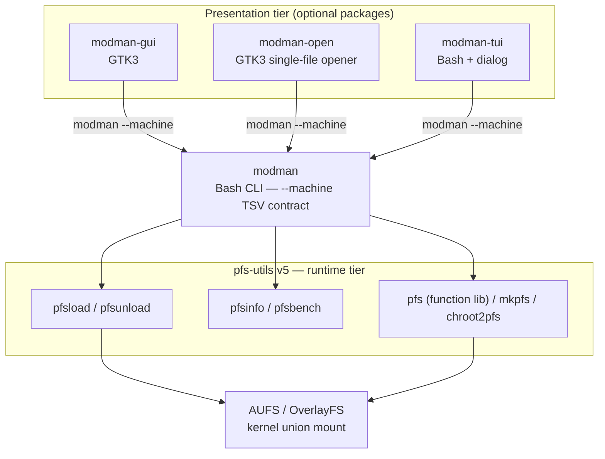

# modman

**Module manager for any frugal / live-CD Linux.**

`modman` hot-attaches and detaches `.pfs` / `.erofs` squashfs modules on a
running AUFS or OverlayFS root, on any frugal / live-CD Linux install. It is a
thin, machine-first contract layer on top of
[pfs-utils v5](https://github.com/sfs-pra/pfs-utils-05), with optional GTK3 and
terminal frontends.

[English](README.md) | [Русский](README.ru.md)

---

## Screenshots

### Graphical frontend — `modman-gui`


### Terminal frontend — `modman-tui`


---

## What is modman

A frugal Linux system boots a read-only base built from squashfs `.pfs`
modules and keeps changes in a writable layer. `modman` lets you, **after
boot**:

- search a remote repository and download modules;
- attach (`load`) and detach (`unload`) modules without rebooting;
- list what is loaded by the initrd vs. loaded at runtime vs. only downloaded;
- check for and apply module updates with backups and risk classification.

Every file-level operation is delegated to `pfs-utils`. `modman` itself never
touches the kernel union directly — it routes, validates, and emits a stable
machine-readable contract.

---

## Architecture

`modman` is a **three-tier** system. Each tier has one job and talks only to
the tier directly below it.



### Tier 1 — `pfs-utils` v5 (runtime)

The lowest layer. It owns everything that touches the filesystem and the
kernel: AUFS / OverlayFS mount and unmount, squashfs / erofs format detection,
initrd / layering-mode detection, module build and extraction. Shipped
separately as the `pfs-utils-cli` package
([sfs-pra/pfs-utils-05](https://github.com/sfs-pra/pfs-utils-05)). Key tools:
`pfsload`, `pfsunload`, `pfsinfo`, `pfs`, `pfsbench`.

### Tier 2 — `modman` (Bash CLI, the contract)

The heart of the project. It:

- resolves dependencies, downloads modules, and routes to `pfsload` /
  `pfsunload`;
- normalizes everything into the locale-independent `--machine` TSV contract;
- validates module names before any subprocess call (no shell concatenation);
- manages the update lifecycle (check / apply / blacklist / reboot signalling);
- supports two CLI dialects: **pacman-style** (`-S`, `-R`, `-Ss`, `-Sy`, the
  default) and **apt-style** (`install`, `remove`, `search`, `update`).

### Tier 3 — frontends (optional)

- **modman-gui** — GTK3 graphical manager: async, cancellable operations,
  debounced search, polkit integration, tabbed view.
- **modman-open** — minimal GTK3 "Open with…" handler for a single `.pfs`
  from a file manager (MIME `application/x-pfs`). Ships inside `modman-gui`.
- **modman-tui** — terminal frontend built on `dialog`.

**Hard rule:** frontends never call `pfsload`, `pfsunload`, `pacman`, `sudo`,
or `pkexec` directly. They only call `modman --machine` and parse its TSV
output. This keeps presentation and runtime fully decoupled.

---

## Components

| Package | Binary | Role | Depends on |
| --- | --- | --- | --- |
| `modman` | `modman` | CLI backend + `--machine` contract | `bash`, `pfs-utils-cli>=2026.04` |
| `modman-gui` | `modman-gui`, `modman-open` | GTK3 manager + file opener | `modman`, `gtk3`, `glib2` |
| `modman-tui` | `modman-tui` | `dialog` terminal frontend | `modman`, `dialog`, `gettext` |

---

## Core concepts

### Modules and identity

A **module** is a squashfs (or erofs) archive holding a directory tree rooted
at `/`. A **PFS module** is one built by `mkpfs` / `mkpfs-erofs`, carrying
metadata (`pfs.files`, `pfs.specs`, `pfs.depends`). A module built from one
source is **simple**; from several, **composite** (a container).

**identity** is the short cache key derived from the filename by trimming
version, architecture, and revision tags:

```text
evince-gtk3-p-3.26.0_64-sf06.pfs  ->  evince-gtk3-p
030-gtk3-2601-sf03.pfs            ->  030-gtk3
```

### Where a module lives

| State | Source command | Meaning |
| --- | --- | --- |
| **Loaded — before** | `modman --list-loaded-before` (`-Lb`) | Base modules attached by the initrd. Unloading mutates the running base. |
| **Loaded — after** | `modman --list-loaded-after` (`-La`) | Hot-attached at runtime. Safe to unload. |
| **Local** | `modman --list-local` (`-Ql`) | Downloaded `.pfs`, not attached. |
| **Repo / online** | `modman -Ss <query>` | Remote repository search, overlaid with matching local files. |

These four states map directly onto the GUI tabs
(*Подключенные / Инет / Локальные / Система*).

---

## The `--machine` contract

`--machine` switches all stdout to tab-separated values, suppresses colored
human messages, and keeps errors on stderr. It is the **single API** the GUI
and TUI consume.

Loaded-module listing — 6 fields per line:

```text
name<TAB>layer<TAB>path<TAB>version<TAB>mount_mode<TAB>mount_in_ram
```

Update check — 11 fields per line:

```text
update<TAB>id<TAB>name<TAB>old_version<TAB>new_version<TAB>installed_path<TAB>candidate_filename<TAB>repo<TAB>risk<TAB>reboot_required<TAB>message
```

The `risk` field classifies each update:

- **normal** — module not loaded in the current session;
- **loaded** — hot-attached at runtime; safe, takes effect after reboot;
- **system** — attached by the initrd; requires `--confirm-system-updates`.

When `reboot_required=1`, `modman` appends the literal line `нужна
перезагрузка` to machine output. Parsers must match it verbatim. A reboot is
**never** performed automatically.

---

## Boot stacks and the AUFS vs. OverlayFS limit

Initrd detection is delegated to `pfs-utils` drop-in detectors:

| Detector | initrd | Layering | AUFS prefix |
| --- | --- | --- | --- |
| `10-uird.sh` | uird | overlay | `${SYSMNT}/bundles` |
| `20-rootaufs2.sh` | rootaufs2 | aufs | `/run/archroot/live/memory/images` |
| `30-porteus.sh` | porteus | aufs | `${SYSMNT}/bundles` |
| `40-livekit.sh` | livekit | overlay | `${SYSMNT}/bundles` |

Add a new type by dropping `50-yourname.sh` into
`/usr/local/lib/pfs-utils/initrd-detectors/`.

**Important kernel limit:** AUFS supports adding a layer to a live root
(`mount -o remount,append:`). OverlayFS **cannot** add a `lowerdir` to an
active mount. On overlay-root systems, system-wide hot-load is unavailable;
use `pfsrun` (private mount namespace) to run an app with a module instead.
Full survey: [`docs/aufs-alternatives.md`](docs/aufs-alternatives.md)
([на русском](docs/aufs-alternatives.ru.md) /
[dokuwiki](docs/aufs-alternatives.dokuwiki)).

---

## Installation

### From source with `makepkg` (Arch-like)

```bash
# Release build from the working tree:
makepkg -si

# Or build straight from git:
makepkg -p PKGBUILD.git -si
```

This produces and installs the `modman`, `modman-gui`, and `modman-tui`
packages.

### Manual build of the GUI binaries

```bash
gcc -Wall -Wextra -O2 -pipe -Iinclude \
    -DDEFAULT_MODMAN_BIN='"/usr/bin/modman"' \
    -DDEFAULT_DOWNLOAD_DIR='"/var/lib/modman/modules"' \
    -DMODMAN_LOCALEDIR='"/usr/share/locale"' \
    src/main.c src/ui.c src/backend.c src/model.c \
    src/validators.c src/capabilities.c src/ui_debug.c \
    $(pkg-config --cflags --libs gtk+-3.0 gio-2.0) \
    -o modman-gui
```

The CLI (`modman`) and TUI (`modman-tui`) are scripts — no compilation needed.

---

## Usage

### CLI quickstart

```bash
# Sync the index cache with the mirrors
modman -Sy

# Search the repository
modman -Ss evince

# Install (resolves deps, downloads, attaches via pfsload)
sudo modman -S evince

# List what is attached at runtime
modman --list-loaded-after

# Detach
sudo modman -R evince

# Remove a downloaded file
modman -Rl evince
```

apt-style equivalents exist for the common verbs:
`modman update` / `search` / `install` / `remove`.

Load-mode and download-dir overrides:

```bash
sudo modman --lower -S evince          # attach to the lower AUFS layer
sudo modman --toram -S evince          # copy into tmpfs first
sudo modman -d /tmp/modman-cache -S evince
```

### GUI

```bash
modman-gui            # full manager
modman-gui --updates  # open on the Updates tab
modman-open file.pfs  # single-file "Open with…" handler
```

### TUI

```bash
modman-tui
```

---

## Update management

```bash
modman -Sy                                   # 1. sync cache
modman --machine --check-updates             # 2. inspect (no root, never writes)
sudo modman --update <id>                     # 3. apply one update (keeps .old backup)
sudo modman --update-all                      # apply all non-system updates
sudo modman --update-all --confirm-system-updates  # include system modules
modman --update-blacklist-add evince-3.26.0.pfs     # pin/skip a version
```

A login-time helper, `modman-update-check` (XDG autostart), runs
`--check-updates` and only sends a `notify-send` notification — it never
applies anything. Toggle with `UPDATE_CHECK_ON_LOGIN` in `modman.conf`.

---

## Configuration

Read in increasing priority:

1. `/usr/share/modman/modman.conf` — shipped defaults;
2. `/etc/modman.conf` — system-wide;
3. `~/.config/modman/modman.conf` (or `$XDG_CONFIG_HOME/modman/modman.conf`) —
   per-user.

Key variables:

| Variable | Purpose |
| --- | --- |
| `DOWNLOAD_DIR` | Where modules are downloaded (auto-detected on rootaufs2). |
| `AUFS_INITRD_PREFIX` | Prefix used to detect initrd modules. |
| `EXT` | Module container extension (default `pfs`). |
| `CLI_STYLE` | `pacman` (default) or `apt`. |
| `CMD_LOAD` / `CMD_UNLOAD` | Backend load/unload commands (`pfsload` / `pfsunload`). |
| `REPO_URLS` | Repository mirror list. |
| `MODMAN_STATE_DIR` | Persistent state (default `/var/lib/modman`). |
| `UPDATE_CHECK_ON_LOGIN` | `1`/`0` — login-time update check. |

See [`modman.conf(5)`](docs/modman.conf.5) for the full reference.

---

## Dependencies

- `bash`
- `pfs-utils-cli >= 2026.04` (`pfsload`, `pfsunload`, `pfsinfo`, `pfs`, `pfsbench`)
- `gtk3`, `glib2` — GUI only
- `polkit` — root operations from the GUI
- `dialog` — TUI only
- `wget` — module and cache downloads
- `squashfs-tools` — `.pfs` handling
- `erofs-utils` — optional, erofs modules
- `libnotify` — `notify-send` for the login update check

---

## Documentation

- [`docs/modman.dokuwiki`](docs/modman.dokuwiki) — full CLI / GUI reference
- [`docs/modman-architecture.md`](docs/modman-architecture.md) — GUI contracts
- [`docs/aufs-alternatives.md`](docs/aufs-alternatives.md) — AUFS vs. OverlayFS
  dynamic-load survey
- Man pages: `modman(8)`, `modman.conf(5)`, `modman-open(1)`, `modman-tui(8)`
- [`pfs-utils` documentation](https://github.com/sfs-pra/pfs-utils-05)

---

## Related projects

- [sfs-pra/pfs-utils-05](https://github.com/sfs-pra/pfs-utils-05) — the
  `pfs-utils` v5 runtime that modman drives.

---

## License

[MIT](LICENSE).
