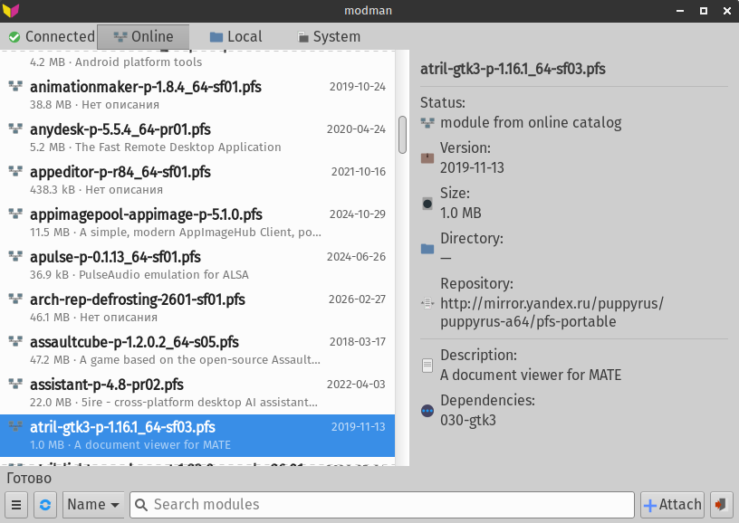
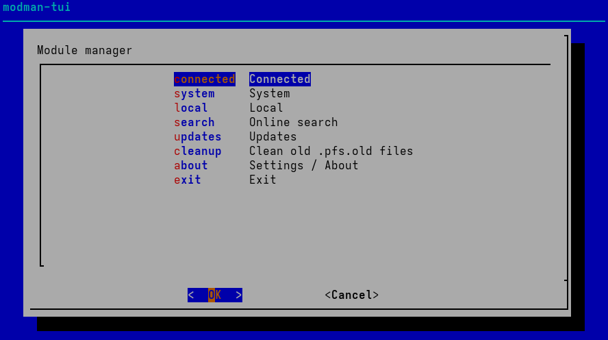
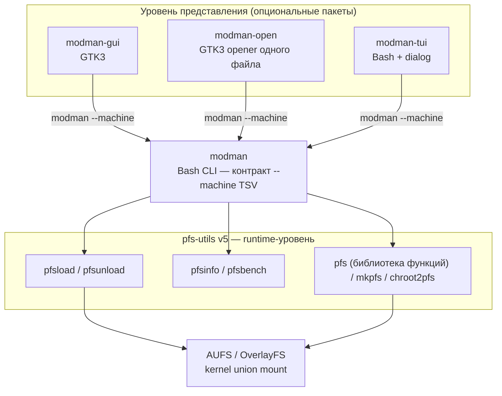

# modman

**Менеджер модулей для любого frugal / live-CD Linux.**

`modman` подключает и отключает squashfs-модули `.pfs` / `.erofs` на живом
AUFS- или OverlayFS-корне, на любой frugal / live-CD Linux установке. Это
тонкий machine-first контрактный слой поверх
[pfs-utils v5](https://github.com/sfs-pra/pfs-utils-05) с опциональными GTK3- и
терминальным frontend'ами.

[English](README.md) | [Русский](README.ru.md)

---

## Скриншоты

### Графический frontend — `modman-gui`



### Терминальный frontend — `modman-tui`



---

## Что такое modman

Frugal-система загружает read-only базу, собранную из squashfs-модулей `.pfs`,
и хранит изменения в записываемом слое. `modman` позволяет **после загрузки**:

- искать модули в удалённом репозитории и скачивать их;
- подключать (`load`) и отключать (`unload`) модули без перезагрузки;
- видеть, что загружено initrd, что подключено в runtime, а что лишь скачано;
- проверять и применять обновления модулей с резервными копиями и оценкой
  риска.

Любая файловая операция делегируется в `pfs-utils`. Сам `modman` никогда не
трогает kernel union напрямую — он маршрутизирует, валидирует и выдаёт
стабильный машиночитаемый контракт.

---

## Архитектура

`modman` — **трёхуровневая** система. У каждого уровня одна задача, и он
общается только с уровнем непосредственно под ним.



### Уровень 1 — `pfs-utils` v5 (runtime)

Нижний слой. Владеет всем, что касается файловой системы и ядра: AUFS /
OverlayFS mount и unmount, детект формата squashfs / erofs, детект initrd и
режима слоёв, сборка и разборка модулей. Поставляется отдельным пакетом
`pfs-utils-cli`
([sfs-pra/pfs-utils-05](https://github.com/sfs-pra/pfs-utils-05)). Ключевые
утилиты: `pfsload`, `pfsunload`, `pfsinfo`, `pfs`, `pfsbench`.

### Уровень 2 — `modman` (Bash CLI, контракт)

Сердце проекта. Он:

- разрешает зависимости, скачивает модули и маршрутизирует в `pfsload` /
  `pfsunload`;
- нормализует всё в локаленезависимый контракт `--machine` TSV;
- валидирует имена модулей до любого вызова подпроцесса (без shell-конкатенации);
- управляет жизненным циклом обновлений (проверка / применение / чёрный список /
  сигнал о перезагрузке);
- поддерживает два диалекта CLI: **pacman-style** (`-S`, `-R`, `-Ss`, `-Sy` —
  по умолчанию) и **apt-style** (`install`, `remove`, `search`, `update`).

### Уровень 3 — frontend'ы (опционально)

- **modman-gui** — графический GTK3-менеджер: асинхронные операции с отменой,
  debounce поиска, polkit-интеграция, вкладки.
- **modman-open** — минимальный GTK3-обработчик «Открыть с помощью…» для
  одного `.pfs` из файлового менеджера (MIME `application/x-pfs`). Входит в
  пакет `modman-gui`.
- **modman-tui** — терминальный frontend на базе `dialog`.

**Жёсткое правило:** frontend'ы никогда не вызывают `pfsload`, `pfsunload`,
`pacman`, `sudo` или `pkexec` напрямую. Они вызывают только `modman --machine`
и парсят его TSV-вывод. Это полностью развязывает представление и runtime.

---

## Компоненты

| Пакет | Бинарник | Роль | Зависит от |
| --- | --- | --- | --- |
| `modman` | `modman` | CLI-бэкенд + контракт `--machine` | `bash`, `pfs-utils-cli>=2026.04` |
| `modman-gui` | `modman-gui`, `modman-open` | GTK3-менеджер + opener | `modman`, `gtk3`, `glib2` |
| `modman-tui` | `modman-tui` | терминальный frontend (`dialog`) | `modman`, `dialog`, `gettext` |

---

## Ключевые понятия

### Модули и identity

**Модуль** — squashfs- (или erofs-) архив с деревом каталогов от корня `/`.
**PFS-модуль** — собранный через `mkpfs` / `mkpfs-erofs`, несёт метаданные
(`pfs.files`, `pfs.specs`, `pfs.depends`). Модуль из одного источника —
**простой**; из нескольких — **составной** (контейнер).

**identity** — короткий ключ кэша, полученный из имени файла обрезкой версии,
архитектуры и тегов ревизии:

```text
evince-gtk3-p-3.26.0_64-sf06.pfs  ->  evince-gtk3-p
030-gtk3-2601-sf03.pfs            ->  030-gtk3
```

### Где находится модуль

| Состояние | Команда-источник | Значение |
| --- | --- | --- |
| **Загружен — до** | `modman --list-loaded-before` (`-Lb`) | Базовые модули, подключённые initrd. Отключение меняет работающую базу. |
| **Загружен — после** | `modman --list-loaded-after` (`-La`) | Подключён в runtime. Безопасно отключать. |
| **Локальный** | `modman --list-local` (`-Ql`) | Скачанный `.pfs`, не подключён. |
| **Репозиторий / инет** | `modman -Ss <query>` | Поиск в удалённом репозитории с наложением локальных файлов. |

Эти четыре состояния напрямую соответствуют вкладкам GUI
(*Подключенные / Инет / Локальные / Система*).

---

## Контракт `--machine`

`--machine` переключает весь stdout в tab-separated values, подавляет цветные
сообщения для человека и оставляет ошибки в stderr. Это **единственный API**,
который потребляют GUI и TUI.

Листинг загруженных модулей — 6 полей на строку:

```text
name<TAB>layer<TAB>path<TAB>version<TAB>mount_mode<TAB>mount_in_ram
```

Проверка обновлений — 11 полей на строку:

```text
update<TAB>id<TAB>name<TAB>old_version<TAB>new_version<TAB>installed_path<TAB>candidate_filename<TAB>repo<TAB>risk<TAB>reboot_required<TAB>message
```

Поле `risk` классифицирует каждое обновление:

- **normal** — модуль не загружен в текущей сессии;
- **loaded** — подключён в runtime; безопасно, вступит в силу после
  перезагрузки;
- **system** — подключён initrd; требует `--confirm-system-updates`.

Если `reboot_required=1`, `modman` добавляет в machine output дословную строку
`нужна перезагрузка`. Парсеры должны сопоставлять её как литерал. Перезагрузка
**никогда** не выполняется автоматически.

---

## Boot-стеки и ограничение AUFS против OverlayFS

Детект initrd делегируется drop-in детекторам `pfs-utils`:

| Детектор | initrd | Слойность | AUFS-префикс |
| --- | --- | --- | --- |
| `10-uird.sh` | uird | overlay | `${SYSMNT}/bundles` |
| `20-rootaufs2.sh` | rootaufs2 | aufs | `/run/archroot/live/memory/images` |
| `30-porteus.sh` | porteus | aufs | `${SYSMNT}/bundles` |
| `40-livekit.sh` | livekit | overlay | `${SYSMNT}/bundles` |

Новый тип добавляется drop-in: положите `50-yourname.sh` в
`/usr/local/lib/pfs-utils/initrd-detectors/`.

**Важное ограничение ядра:** AUFS умеет добавлять слой к живому корню
(`mount -o remount,append:`). OverlayFS **не может** добавить `lowerdir` к
активному mount. На overlay-root системах системное горячее подключение
недоступно; используйте `pfsrun` (приватный mount namespace), чтобы запустить
приложение с модулем. Полный обзор:
[`docs/aufs-alternatives.ru.md`](docs/aufs-alternatives.ru.md)
([English](docs/aufs-alternatives.md) /
[dokuwiki](docs/aufs-alternatives.dokuwiki)).

---

## Установка

### Из исходников через `makepkg` (Arch-подобные)

```bash
# Релизная сборка из рабочего дерева:
makepkg -si

# Либо сборка прямо из git:
makepkg -p PKGBUILD.git -si
```

Это собирает и устанавливает пакеты `modman`, `modman-gui` и `modman-tui`.

### Ручная сборка GUI-бинарников

```bash
gcc -Wall -Wextra -O2 -pipe -Iinclude \
    -DDEFAULT_MODMAN_BIN='"/usr/bin/modman"' \
    -DDEFAULT_DOWNLOAD_DIR='"/var/lib/modman/modules"' \
    -DMODMAN_LOCALEDIR='"/usr/share/locale"' \
    src/main.c src/ui.c src/backend.c src/model.c \
    src/validators.c src/capabilities.c src/ui_debug.c \
    $(pkg-config --cflags --libs gtk+-3.0 gio-2.0) \
    -o modman-gui
```

CLI (`modman`) и TUI (`modman-tui`) — скрипты, компиляция не нужна.

---

## Использование

### Быстрый старт CLI

```bash
# Синхронизировать кэш индексов с зеркалами
modman -Sy

# Поиск в репозитории
modman -Ss evince

# Установка (разрешает зависимости, скачивает, подключает через pfsload)
sudo modman -S evince

# Список подключённого в runtime
modman --list-loaded-after

# Отключение
sudo modman -R evince

# Удаление скачанного файла
modman -Rl evince
```

Для основных глаголов есть apt-style эквиваленты:
`modman update` / `search` / `install` / `remove`.

Переопределение режима загрузки и каталога:

```bash
sudo modman --lower -S evince          # подключить в нижний слой AUFS
sudo modman --toram -S evince          # сначала скопировать в tmpfs
sudo modman -d /tmp/modman-cache -S evince
```

### GUI

```bash
modman-gui            # полный менеджер
modman-gui --updates  # открыть на вкладке обновлений
modman-open file.pfs  # обработчик «Открыть с помощью…» одного файла
```

### TUI

```bash
modman-tui
```

---

## Управление обновлениями

```bash
modman -Sy                                   # 1. синхронизировать кэш
modman --machine --check-updates             # 2. проверить (без root, не пишет файлы)
sudo modman --update <id>                     # 3. применить одно (сохраняет .old)
sudo modman --update-all                      # применить все несистемные
sudo modman --update-all --confirm-system-updates  # включая системные модули
modman --update-blacklist-add evince-3.26.0.pfs     # заблокировать версию
```

Хелпер `modman-update-check` (XDG autostart) запускается при входе, выполняет
`--check-updates` и только шлёт уведомление через `notify-send` — ничего не
применяет. Управляется ключом `UPDATE_CHECK_ON_LOGIN` в `modman.conf`.

---

## Конфигурация

Читается по возрастанию приоритета:

1. `/usr/share/modman/modman.conf` — поставляемые умолчания;
2. `/etc/modman.conf` — общесистемная;
3. `~/.config/modman/modman.conf` (или `$XDG_CONFIG_HOME/modman/modman.conf`) —
   пользовательская.

Ключевые переменные:

| Переменная | Назначение |
| --- | --- |
| `DOWNLOAD_DIR` | Куда скачиваются модули (автодетект на rootaufs2). |
| `AUFS_INITRD_PREFIX` | Префикс для детекта initrd-модулей. |
| `EXT` | Расширение контейнера модуля (по умолчанию `pfs`). |
| `CLI_STYLE` | `pacman` (по умолчанию) или `apt`. |
| `CMD_LOAD` / `CMD_UNLOAD` | Команды загрузки/выгрузки (`pfsload` / `pfsunload`). |
| `REPO_URLS` | Список зеркал репозитория. |
| `MODMAN_STATE_DIR` | Постоянное состояние (по умолчанию `/var/lib/modman`). |
| `UPDATE_CHECK_ON_LOGIN` | `1`/`0` — проверка обновлений при входе. |

Полная справка: [`modman.conf(5)`](docs/modman.conf.5).

---

## Зависимости

- `bash`
- `pfs-utils-cli >= 2026.04` (`pfsload`, `pfsunload`, `pfsinfo`, `pfs`, `pfsbench`)
- `gtk3`, `glib2` — только для GUI
- `polkit` — root-операции из GUI
- `dialog` — только для TUI
- `wget` — загрузка модулей и кэша
- `squashfs-tools` — работа с `.pfs`
- `erofs-utils` — опционально, erofs-модули
- `libnotify` — `notify-send` для проверки обновлений при входе

---

## Документация

- [`docs/modman.dokuwiki`](docs/modman.dokuwiki) — полная справка CLI / GUI
- [`docs/modman-architecture.md`](docs/modman-architecture.md) — контракты GUI
- [`docs/aufs-alternatives.ru.md`](docs/aufs-alternatives.ru.md) — обзор
  динамической загрузки AUFS против OverlayFS
- Man-страницы: `modman(8)`, `modman.conf(5)`, `modman-open(1)`, `modman-tui(8)`
- [Документация `pfs-utils`](https://github.com/sfs-pra/pfs-utils-05)

---

## Связанные проекты

- [sfs-pra/pfs-utils-05](https://github.com/sfs-pra/pfs-utils-05) — runtime
  `pfs-utils` v5, которым управляет modman.

---

## Лицензия

[MIT](LICENSE).
